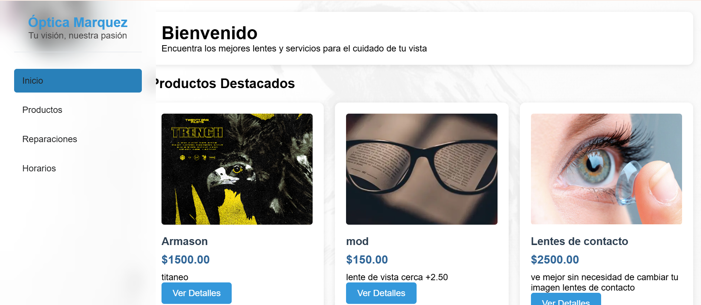
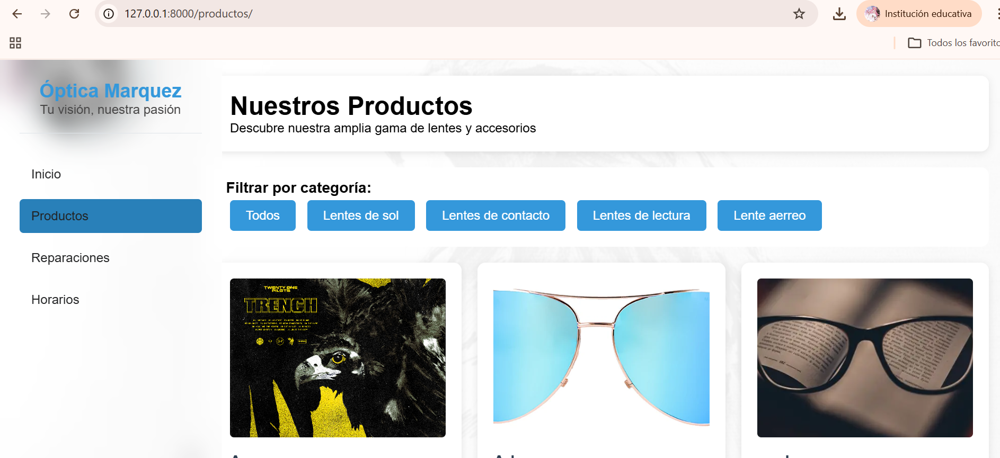
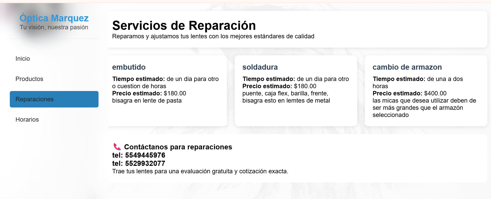
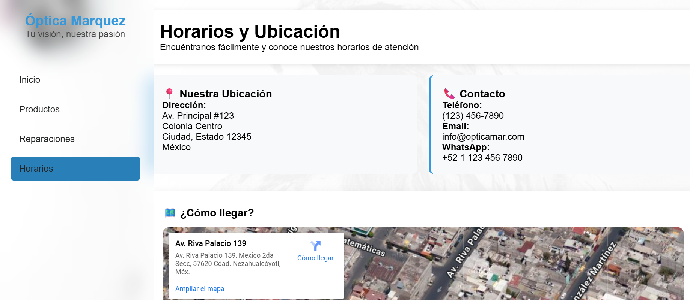

# Reporte de Cierre: Sprint 1

**Fecha de Inicio:** 17 de Febrero de 2026

**Fecha de finalización:** 05 de Marzo de 2026

**Estado:** Completado ✅

## Sprint Planning (Planificación del Sprint).
Las dos primeras semanas fueron los siguientes roles asignadas en el equipo.
Aaron Jefe Product Owner
Erick Subjefe Scrum Master
Daniel Programador Development Team
Fernando Programador Development Team
María Programador Development Team

## Objetivos para Alcanzar (Frontend)
Durante este primer sprint, nos estaremos enfocamos en estructurar la página principal (`inicio.html`) y mejorar la navegación del sitio (`base.html`). 
Se completaron las siguientes tareas:

* **Rediseño de Página Principal:** * Se inició la transición del menú lateral hacia un menú superior estático. Este cambio busca modernizar la interfaz y optimizar el aprovechamiento del ancho de banda visual en pantalla. A continuación, se visualiza el estado actual de la página principal antes de las modificaciones mayores del Sprint 2.
Se actualizara el archivo `PaginaInicio.png`.
  
![Captura de Optica]
* **Carrusel Dinámico:** Se implementó un carrusel de imágenes responsivo en la página de inicio, controlado con JavaScript puro y CSS.
  
* **Sección de Ofertas:** Se reutilizaron los estilos de tarjetas de productos para destacar artículos con descuento.
  Se actualizara el archivo `PaginaInicio.png`.
  
![Captura de Optica]
* **Promociones del Mes:** Se agregara un banner visualmente distintivo para comunicar las promociones vigentes (ej. 2x1 y exámenes gratis).
    Se actualizara el archivo `PaginaInicio.png`.
  
![Captura de Optica]
* **Horarios de Atención:** Se integrara un bloque informativo claro con los días y horas de servicio de la óptica, por el momento asi se encuentra actualmente la página antes de iniciar los cambios correspondientes.
Se actualizara el archivo `PaginaServicios.png`.
  
![Captura de Optica]
## Notas Técnicas y Curva de Aprendizaje
Este sprint no solo consistió en escribir código, sino en adaptar nuestro flujo de trabajo a tecnologías estándar de la industria:

1. **Gestión de Versiones (GitHub):** Nos enfrentamos a la curva de aprendizaje de trabajar en equipo usando Git.
     Tuvimos que aprender a manejar *pulls*, *commits*, resolver conflictos de integración (*merge conflicts*) y
     proteger nuestros cambios locales antes de descargar el código de nuestros compañeros.
2. **Entornos Contenerizados (Docker):** El equipo está en proceso de familiarización con Docker para estandarizar el entorno de desarrollo,
    lo cual presentó retos iniciales de configuración, pero nos asegura que el proyecto funcione igual en cualquier computadora.

## Próximos Pasos (Para el Sprint 2)

 
